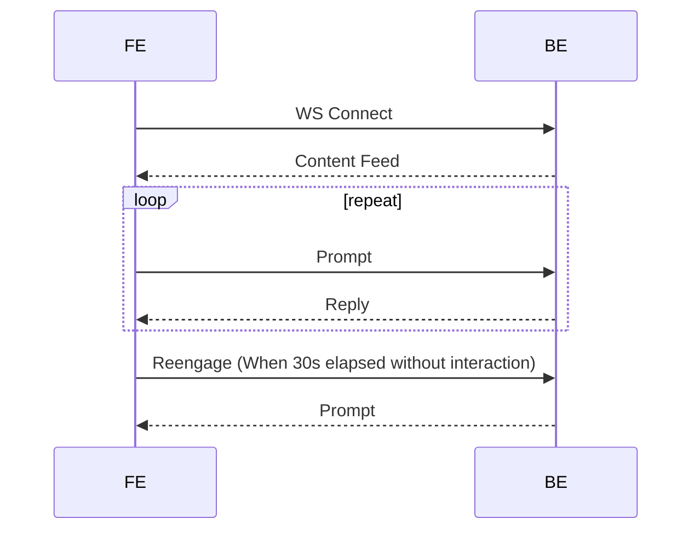

## Terminology 

The key words "MUST", "SHOULD", "NOT RECOMMENDED", and "MAY" in this document are to be interpreted as described in BCP 14 1 when, and only when, they appear in all capitals.

# Transport

FE to BE communicate using a websocket connection
and use JSON for message serialization

# FE -> BE

## Send Prompt

```json
{
    "prompt": "Who plays Katniss?"
}
```

## Reengagement

After a certain time, the FE will send a request
to get user information. It signals that the BE
should reply with questions such as: "What was
your favorite movie of the franchise?"

```json
{
    "ext": "reengage"
}
```

# BE -> FE

```json
{
  "data": "Jennifer Lawrence brings to life the character of Katniss Everdeen in \"The Hunger Games\" film series, captivating audiences with her powerful portrayal. Known for her resilience and sharp survival skills, Katniss becomes a symbol of hope and rebellion against oppression. Lawrence's performance has been pivotal, earning acclaim for her depth and authenticity in the role.<p>[[Asset-0]]<p>Preparing for Katniss required Lawrence to undergo intense physical training and archery lessons, immersing herself in the character's world. This preparation helped her convincingly navigate the physical and emotional landscapes of the dystopian setting, from the perilous Hunger Games arena to the complexities of her relationships.<p>Jennifer Lawrence's role as Katniss Everdeen not only showcased her acting range but also significantly boosted her career, establishing her as a leading actress in Hollywood. Her portrayal resonates with fans for its strength and vulnerability, making Katniss a memorable and inspiring character.",
  "assets": [
    {
      "url": "https://en.wikipedia.org/wiki/Katniss_Everdeen#/media/File:Katniss_Everdeen.jpg",
      "title": "Katniss Everdeen, as portrayed by Jennifer Lawrence in the film the Hunger Games",
      "metadata":{"height":1365,"width":2048,"type":"image"}
    }
  ],
  "followup": [
    "How did Jennifer Lawrence prepare for the role of Katniss Everdeen?",
    "What were the challenges Jennifer Lawrence faced while filming \"The Hunger Games\"?"
  ]
}
```

1. Reply MUST be a valid JSON object
  - data field MAY be omitted. It defaults to "".
  - assets field MAY be omitted. It defaults to [].
  - followup field MAY be omitted. It defaults to [].
1. Paragraphs SHOULD begin with `<p>`. (The first paragraph MAY not have it)
1. Paragraphs after assets MAY not begin with `<p>`
1. Assets MUST be images or videos
1. References to assets MUST be `[[Asset-#]]`. The `#` is the
index of the asset in the `assets` array
1. Assets MUST have a url
1. Assets SHOULD have a title
1. Follow up MUST be simple text (no markup)

{}
The parser splits the data field using a regex that matches
`<p>` or `[[Asset-#]]`. Strings between these separators are
paragraphs, and `[[Asset-#]]` emits an asset.
Empty paragraphs are removed.
{}

## Image Metadata

- Assets SHOULD have a metadata field that indicates height, width and type.
If absent, the FE will get the dimensions from the data (but it may
cause a suboptimal UX) and the type defaults to "image"
- type MUST be either "image" or "video"

```
metadata":{"height":1365,"width":2048,"type":"image"}
```

# Content Feed

1. The first reply from the server MUST be the content feed.
It MAY have no data. The client will ignore the data field
1. It SHOULD have assets. If not, the content feed is empty.
The content feed is the array of assets
1. It SHOULD have followups
1. Assets and followup requirements from previous section apply

{}
Even though the content feed has an empty data field, 
it assumed to reference
to every asset, i.e. `[[Asset-0]][[Asset-1]][[Asset-2]]`...
{}

```json
{
  "assets": [
    {
      "url": "https://en.wikipedia.org/wiki/Katniss_Everdeen#/media/File:Katniss_Everdeen.jpg",
      "title": "Katniss Everdeen, as portrayed by Jennifer Lawrence in the film the Hunger Games"
    }
  ],
  "followup": [
    "How did Jennifer Lawrence prepare for the role of Katniss Everdeen?",
    "What were the challenges Jennifer Lawrence faced while filming \"The Hunger Games\"?"
  ]
}
```

# Sequence


